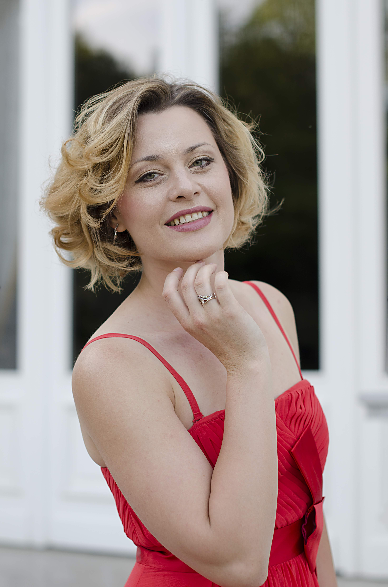

Natalia Ivanova is een Belgische lyrische mezzosopraan. Natalia beschikt over een uitgebreid vocaal bereik, natuurlijke muzikaliteit en een solide vocale techniek. Haar hoge noten zijn stralend, terwijl haar middenstem een romige, karamelachtige kwaliteit heeft. Opera rollen zoals Carmen (Carmen), Charlotte (Werther), Marguerite (La Damnation de Faust) en verschillende broekenrollen zoals Cherubino (Le Nozze di Figaro), Urbain (Les Huguenots) of Annio (La clemenza). di Tito) passen voor haar stem en persoonlijkheid.

Heel vroeg toonde ze interesse voor klassieke muziek. Op achtjarige leeftijd leerde ze muzieknotatie en kreeg ze eerste pianolessen. Daarnaast ging ze naar een balletschool waar ze heel intensief werkte aan de ontwikkeling van melodische geheugen, gevoel voor ritme, elegante lichaamshouding en coördinatie. Op zeventienjarige leeftijd deed ze mee aan een lokale wedstrijd "Kunstbende" wat bracht haar naar de finale in de stemcategorie. Dit ervaring heeft aanleiding gegeven tot haar verdere muzikale studies.

Natalia werd in 2009 toegelaten tot de Luca School of Arts in Leuven. Samen met haar voormalige docente zang Dina Grossberger hebben ze haar artistieke en vocale vaardigheden ontplooid. Na vijf jaar intensieve opleiding behaalde ze Master in de Muziek met onderscheiding. Kort daarna kreeg ze de gelegenheid om les te krijgen bij docente zang Melanie Sonnenberg aan de Universiteit van Houston. In de zomer 2015 nam Natalia deel aan het zomerprogramma genaamd "Le Chiavi di Bel Canto". Tijdens deze sessies werd ze door Nova Thomas, Joseph Evans en Ruth Ann gecoacht.

Op dit moment verkent Natalia het nieuw repertoire en wordt ze gecoacht door regisseur Ronny Lauwers en pianiste Iris de Blaere. Verder werkt ze aan haar YouTube-kanaal, waar ze andere zangers helpt met hun vocale techniek.

Klik hier voor meer informatie over haar artistieke projecten.

Download haar Repertoire [hier]({{ site.baseurl }}/assets/Repertoire_EN.pdf).

Download haar Master in de Muziek [hier]({{ site.baseurl }}/assets/Master_Nl.jpg).

Download haar CV [hier]({{ site.baseurl }}/assets/CV_ND.pdf).                                  
                                                                                   
 Photo Credit: Dirk Hinderyckx
