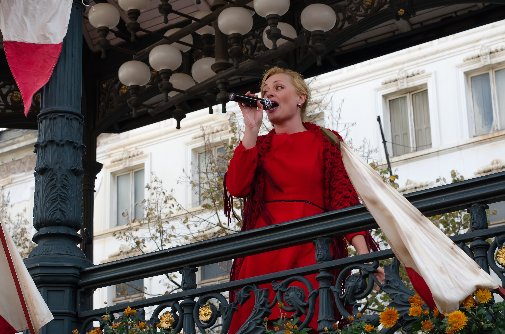
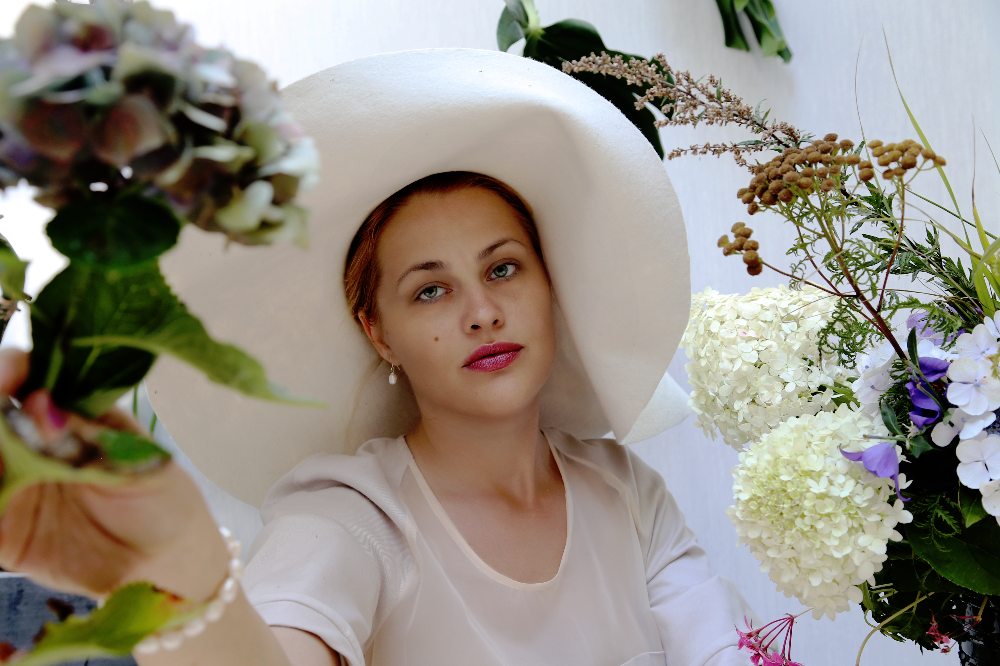
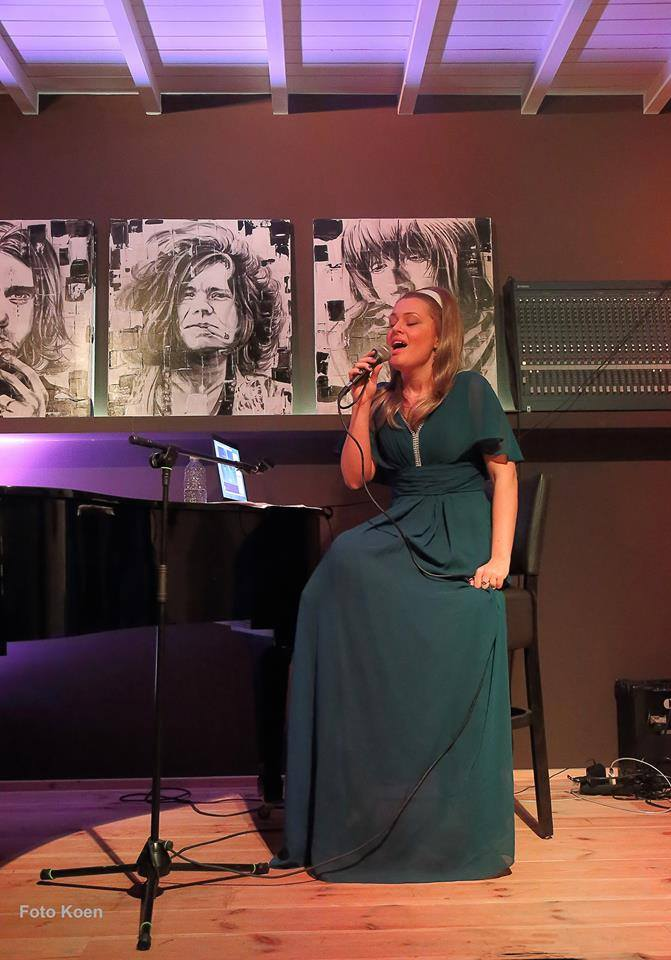
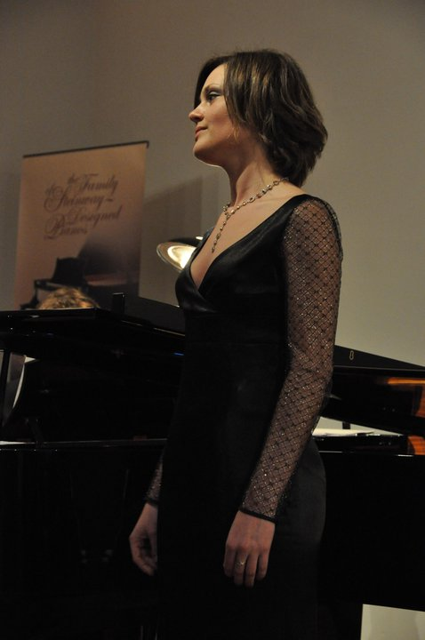

Stem Coaching 2018

Natalia heeft een YouTube kanaal gemaakt waarop ze over de stem ontwikkeling vertelt. Daar kan u verschillende oefeningen vinden die uw stem helpen ontwikkelen. Onderwerpen zoals ademsteun, projectie, vocale mix, levensstijl, fysieke oefeningen en andere hulpmiddelen, die nodig zijn om zangers te helpen met hun zoektocht naar de vocale vrijheid, worden besproken.

Viering van het jubileum van Handelsbeurs 2017

Op 17 oktober vierde het Handelsbeurs hun 15e verjaardag. Natalia kreeg de gelegenheid om deel te nemen aan het Russisch festival georganiseerd door het productiehuis CirQ op Kouter in Gent. Daar zong ze Russische volksliederen begeleid door pianist Mike Julien. Bij deze gelegenheid werd ze ook uitgenodigd om een promotie spot op radio 1 op te nemen.

(Handelsbeurs 15 mp3)

Winterconcert Kasteel Leyselebeke 2017

Mooi klassiek recital georganiseerd in het hart van Sint-Michiels in een prachtig kasteel Leyselebeke. Trio-ensemble bestaande uit Victor Pevernagie, Alexander Declercq en Natalia Ivanova voerden kunstliederen, aria's en duetten uit de romantische en klassieke periode. Het programma bevatte stukken van Tsjaikovski, Bizet, Strauss, Mozart en Berlioz.

Musical "Belle en het Beest" 2017

In de zomer van 2017 voerde dansschool Rose De Leyn musical "Belle en het Beest" uit. Natalia was betrokken bij het project en regisseerde liedjes die in de musical verschenen. Het was een genoegen om jonge dansers te begeleiden naar een geweldige uitvoering.

Concert in de Rose De Leyn 2016

Natalia interpreteerde "Habanera" van Bizet uit de bekende opera "Carmen". Tijdens het concert werd Natalia begeleid door Alexander Declercq. 

Fotosessies met Zoya Victorovna 2016

Zoya en Natalia hebben aan de artistieke foto’s gewerkt. Ze creëerden een catalogus van kleding ontworpen door Zoya Victorovna. Foto's werden geïnspireerd door de zomergloed, schoonheid van de Noordzee, bloemen en film Lady Macbeth.

Photos Credit: Zoya Victorovna

27 Bflat club 2016

Natalia voerde jazzstandaarden uit in het toeristisch hart van Brugge in de jazz club 27Bflat

Foto door Koen de Smet

Dudley Recital Hall concert 2015

Natalia kreeg een studiebeurs om deel te nemen aan het Immanuel en Helen Olshan Texas Music Festivalprogramma. Het zomerprogramma "Le Chiavi di Bel Canto" wordt gehouden aan de Universiteit van Houston in de Moores School of Music. Daar kreeg ze lessen in acteren en dramatische interpretatie, dictie, podiumbewegingen, dans- en lichaamsbewustzijn. De faculteit bestond uit professionele zangers met jarenlange internationale ervaring, zoals Melanie Sonnenberg, Nova Thomas, Joseph Evans en Ruth Ann. Het programma werd afgesloten met een prachtig concert in de Dudley Recital Hall in Houston.

The Ilocano club of Metropolitan Houston 2015

Natalia performed a wonderful rendition of duet “The Prayer” at the gala dinner event held by the Ilocano club of Metropolitan Houston. The event was staged at the prestigious Hilton Houston Galleria Area Hotel. 

Chamber music recitals with Lise Cornillie 2014

Lise and Natalia formed a fruitful collaboration at the Luca School of Arts. Together they discovered numerous art song cycles by romantic and 20th - century composers. They performed chamber music repertoire at the various locations across East Flanders and Flemish Brabant in 2013 and 2014. “The Nursery” by M. Mussorgsky, “Five Elizabethan Songs” by I. Gurney, “A charm of Lullabies” and “Cabaret Songs” by B. Britten, “Siete Canciones Populares Espanolas” by M. de Falla are a few examples from their extended list of repertoire.

Art song concert Luca School of Arts 2013

Chamber music class of Luca School of Arts performed arts songs from romantic era. Natalia sang “Nun hast du mir den ersten Schmerz getan” from song cycle “Frauen-Liebe und Leben” by Robert Schumann and “Nachtgang” by Richard Strauss. 

Dido and Aeneas 2011 - 2012

Two successive years Natalia was engaged in the production of the Baroque opera “Dido and Aeneas” by Henry Purcell. The ensemble was led by conductor Patrick Peire and art director Hugo Segers. Natalia sang in the choir and played two minor roles, namely a drunk sailor and a second witch.

Recital at Pianos Maene in Brussels 2010

Beautiful classical recital that took place in the Piano Maene concert hall. The program included art songs and arias by Nikolai Rimsky-Korsakov, Franz Lehar and Jacques Offenbach. Natalia was accompanied by a talented pianist Peter Jeurissen.

Cocktail dress 2007-2009

For a couple of years Natalia has been a lead singer of a lounge band “Cocktail Dress”. The band consisted of percussion, vocals, electric guitar and bass guitar. They created unique sound and original songs that drew attention of festival organizers. Very soon they were performing at different lounge bars and at the Paulus Festival in Ostend. They released their first LP with original songs and a few covers called “Black Russian”.

(Projects audio Aphrodizzy)

Cover design: Jan-Sebastiaan Degeyter

Kunstbende 2004

Natalia started her journey as a singer by taking part in the local talent competition. She played the piano and sang a cover “How come you don’t call me”. That performance got her straight into the finals. There she encountered other young musicians, photographers, dancers and artists. On that occasion Natalia appeared in the local newspaper Brugsch Handelsblad. This experience motivated Natalia to pursue a career in music.

