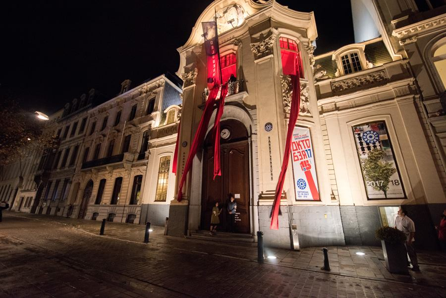
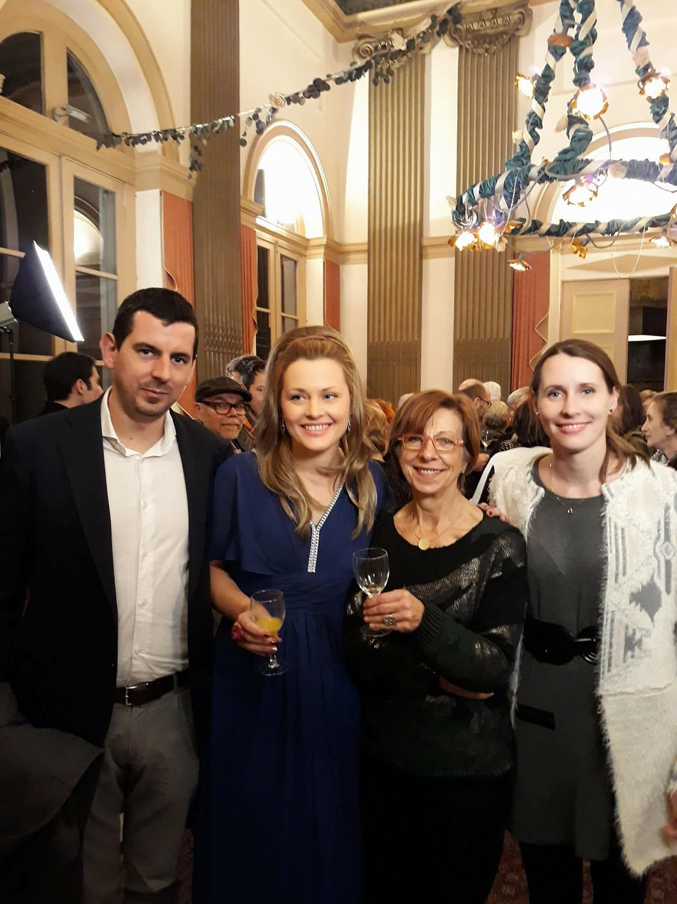
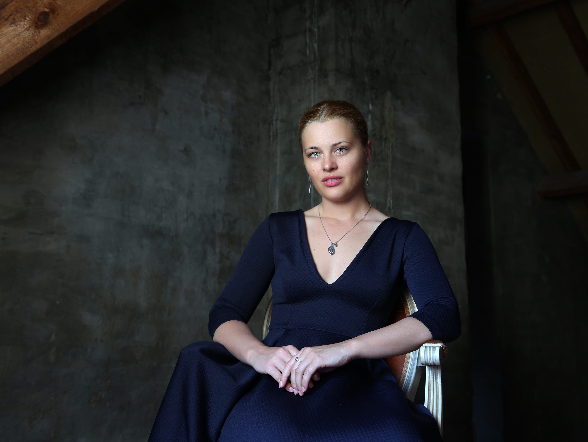
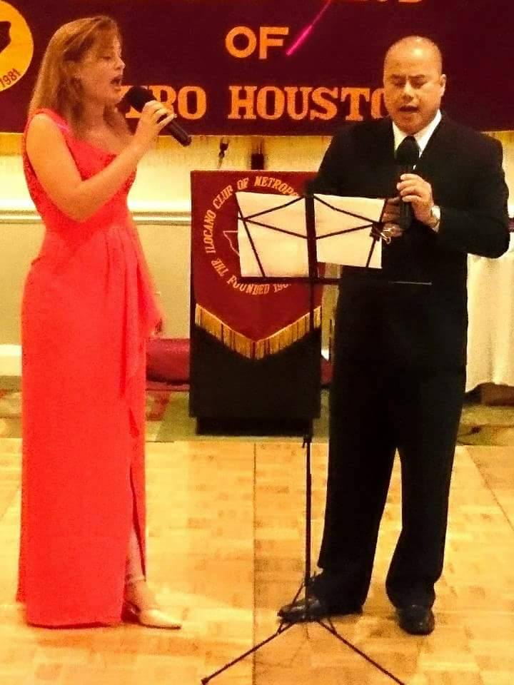
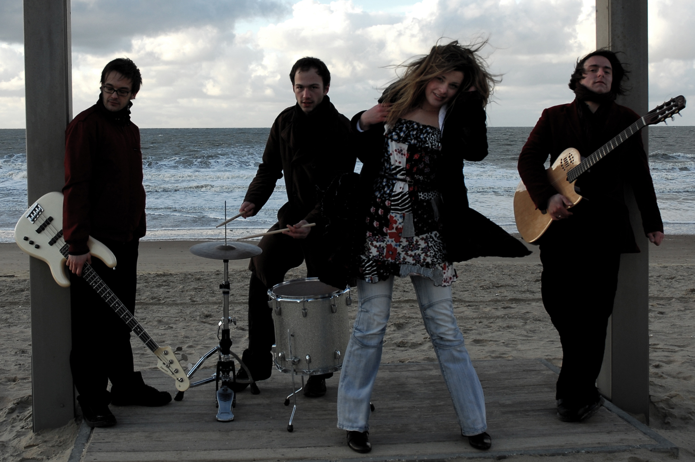

Vocal Coaching 2018

Natalia has created YouTube channel where she shares her experience in vocal development. There you can find various exercises that shape and balance your voice. Topics like breath support, projection, vocal mix, lifestyle, physical exercises and other tools necessary to help singers on their journey to the vocal freedom are being discussed. 

Concert Hall Handelsbeurs 2017

On October 17th  Handelsbeurs Concert Hall celebrated their 15th anniversary. Natalia got an opportunity to take part in the Russian festival organized by CirQ at the main square Kouter in Gent. There she sang Russian folk songs accompanied by pianist Mike Julien. On that occasion she was also invited to record a promotional radio spot on radio 1 in Belgium.

<audio controls src="assets/Handelsbeurs 15.mp3"> </audio>

Winter concert Castle Leyselebeke 2017

Beautiful classical recital organized at the heart of Sint-Michiels in a gorgeous Castle Leyselebeke. Trio ensemble consisting of Victor Pevernagie, Alexander Declercq and Natalia Ivanova performed art songs, arias and duets from Romantic and Classical period. The program included pieces by Tchaikovsky, Bizet, Strauss, Mozart and Berlioz.

Musical Beauty and the Beast 2017

In the summer 2017 dance school Rose De Leyn conducted musical “Beauty and the Beast”. Natalia was engaged in the project and directed songs appearing in the musical. It was a joy to instruct and guide young dancers towards a great performance.

Rose De Leyn concert 2016

Natalia interpreted “Habanera” by Bizet from the iconic opera “Carmen” at the concert in Rose De Leyn. Natalia was accompanied by Alexander Declercq.

Photo shoots with Zoya Victorovna 2016

Zoya and Natalia art directed photo shoots, creating catalogue of clothing designed by Zoya Victorovna. Pictures were inspired by summer glow, beauty of the North Sea, flowers and movie Lady Macbeth.

Photos Credit: Zoya Victorovna

27 Bflat jazz bar performance 2016

Natalia performed jazz standards in the tourist heart of Bruges jazz & blues club 27Bflat.

Photo Credit: Koen

Dudley Recital Hall concert 2015

Natalia received a scholarship to participate at the Immanuel and Helen Olshan Texas Music Festival program. The summer program “Le Chiavi di Bel Canto” is held at the University of Houston Moores School of Music. There she got classes in acting and dramatic interpretation, diction, stage movement, dance and body awareness. The faculty consisted of the professionals with years of international experience, such as Melanie Sonnenberg, Nova Thomas, Joseph Evans and Ruth Ann. The program concluded with a beautiful concert at the Dudley Recital Hall in Houston.

The Ilocano club of Metropolitan Houston 2015

Natalia performed a wonderful rendition of duet “The Prayer” at the gala dinner event held by the Ilocano club of Metropolitan Houston. The event was staged at the prestigious Hilton Houston Galleria Area Hotel. 

Chamber music recitals with Lise Cornillie 2014

Lise and Natalia formed a fruitful collaboration at the Luca School of Arts. Together they discovered numerous art song cycles by romantic and 20th - century composers. They performed chamber music repertoire at the various locations across East Flanders and Flemish Brabant in 2013 and 2014. “The Nursery” by M. Mussorgsky, “Five Elizabethan Songs” by I. Gurney, “A charm of Lullabies” and “Cabaret Songs” by B. Britten, “Siete Canciones Populares Espanolas” by M. de Falla are a few examples from their extended list of repertoire.

Art song concert Luca School of Arts 2013

Chamber music class of Luca School of Arts performed arts songs from romantic era. Natalia sang “Nun hast du mir den ersten Schmerz getan” from song cycle “Frauen-Liebe und Leben” by Robert Schumann and “Nachtgang” by Richard Strauss. 

Dido and Aeneas 2011 - 2012

Two successive years Natalia was engaged in the production of the Baroque opera “Dido and Aeneas” by Henry Purcell. The ensemble was led by conductor Patrick Peire and art director Hugo Segers. Natalia sang in the choir and played two minor roles, namely a drunk sailor and a second witch.

Recital at Pianos Maene in Brussels 2010

Beautiful classical recital that took place in the Piano Maene concert hall. The program included art songs and arias by Nikolai Rimsky-Korsakov, Franz Lehar and Jacques Offenbach. Natalia was accompanied by a talented pianist Peter Jeurissen.

Cocktail dress 2007-2009

For a couple of years Natalia has been a lead singer of a lounge band “Cocktail Dress”. The band consisted of percussion, vocals, electric guitar and bass guitar. They created unique sound and original songs that drew attention of festival organizers. Very soon they were performing at different lounge bars and at the Paulus Festival in Ostend. They released their first LP with original songs and a few covers called “Black Russian”.

<audio controls src="assets/Projects audio Aphrodizzy.MP3"> </audio>

Cover design: Jan-Sebastiaan Degeyter

Kunstbende 2004

Natalia started her journey as a singer by taking part in the local talent competition. She played the piano and sang a cover “How come you don’t call me”. That performance got her straight into the finals. There she encountered other young musicians, photographers, dancers and artists. On that occasion Natalia appeared in the local newspaper Brugsch Handelsblad. This experience motivated Natalia to pursue a career in music.

