Zang Coaching 2018

Natalia heeft een YouTube kanaal gemaakt waar ze over de stem ontwikkeling praat. Daar kan u verschillende oefeningen vinden die uw stem helpen ontwikkelen. Onderwerpen zoals ademsteun, projectie, vocale mix, levensstijl, fysieke oefeningen en andere hulpmiddelen, die nodig zijn om zangers te helpen met hun zoektocht naar de vocale vrijheid, worden besproken.

Viering van het jubileum van Handelsbeurs 2017

Op 17 oktober vierde het Handelsbeurs haar 15e verjaardag. Natalia kreeg de gelegenheid om deel te nemen aan het Russisch festival georganiseerd door het productiehuis CirQ op Kouter in Gent. Daar zong ze Russische volksliederen begeleid door pianist Mike Julien. Bij deze gelegenheid werd ze ook uitgenodigd om een promotie spot op radio 1 op te nemen.

<audio controls src="assets/Handelsbeurs 15.mp3"> </audio>

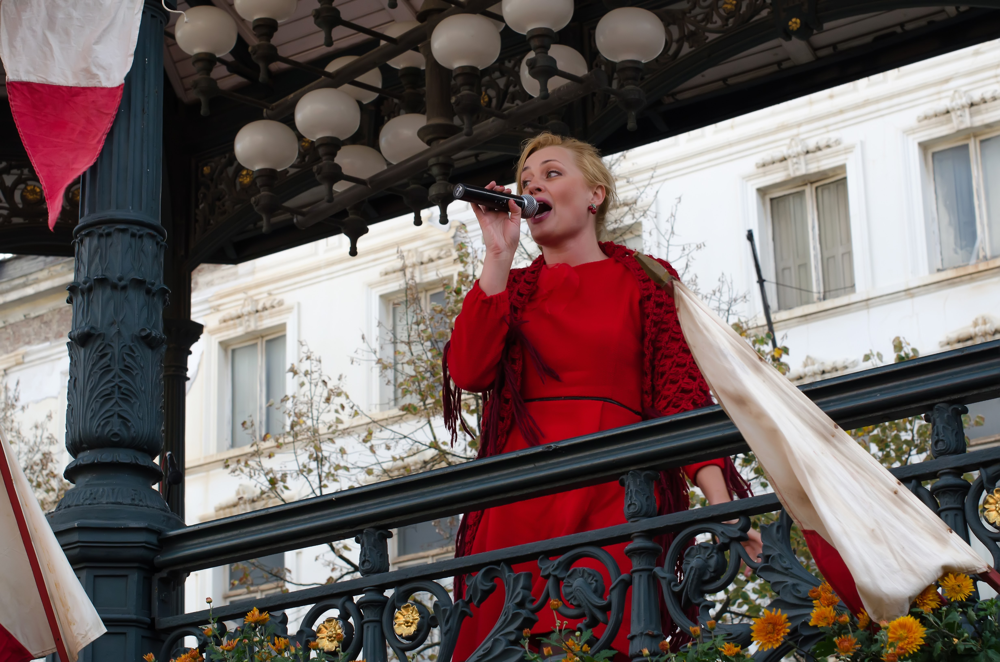

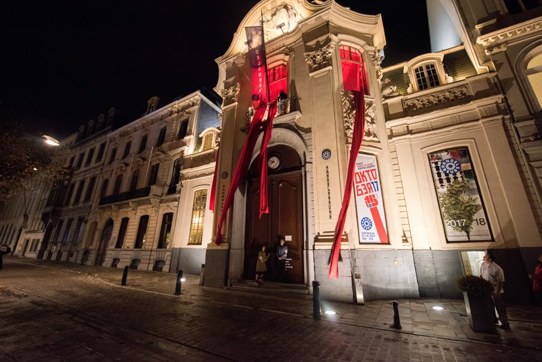

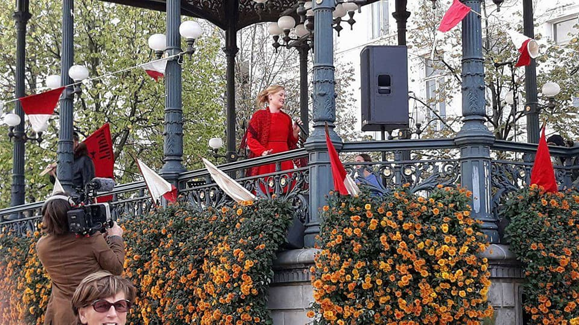

Winterconcert Kasteel Leyselebeke 2017

Mooi klassiek recital georganiseerd in het hart van Sint-Michiels in een prachtig kasteel Leyselebeke. Trio-ensemble bestaande uit Victor Pevernagie, Alexander Declercq en Natalia Ivanova voerden kunstliederen, aria's en duetten uit uit de romantische en klassieke periode. Het programma bevatte stukken van Tsjaikovski, Bizet, Strauss, Mozart en Berlioz.

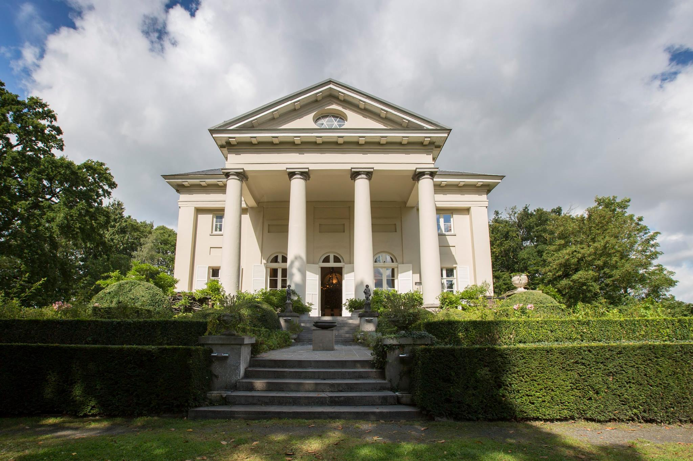

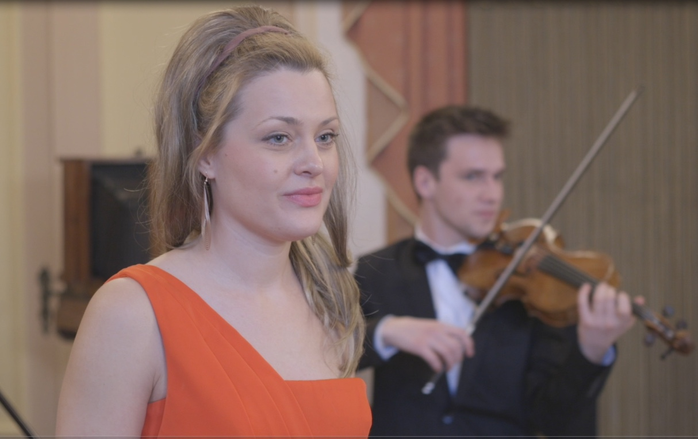

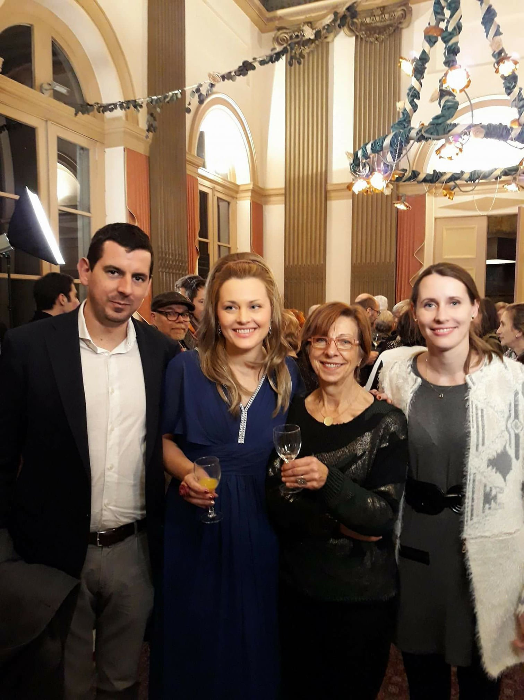

Musical "Belle en het Beest" 2017

In de zomer van 2017 voerde dansschool Rose De Leyn musical "Belle en het Beest" uit. Natalia deed mee aan dat project en regisseerde liedjes die in de musical verschenen. Het was een genoegen om jonge dansers naar een geweldige uitvoering te begeleiden.

Concert in de Rose De Leyn 2016

Natalia interpreteerde "Habanera" van Bizet uit de bekende opera "Carmen". Tijdens het concert werd Natalia door Alexander Declercq op de piano begeleid.

Fotosessies met Zoya Victorovna 2016

Zoya en Natalia hebben aan de artistieke foto’s gewerkt. Ze creëerden een catalogus van kleding ontworpen door Zoya Victorovna. Foto's werden geïnspireerd door de zomergloed, schoonheid van de Noordzee, bloemen en film Lady Macbeth.

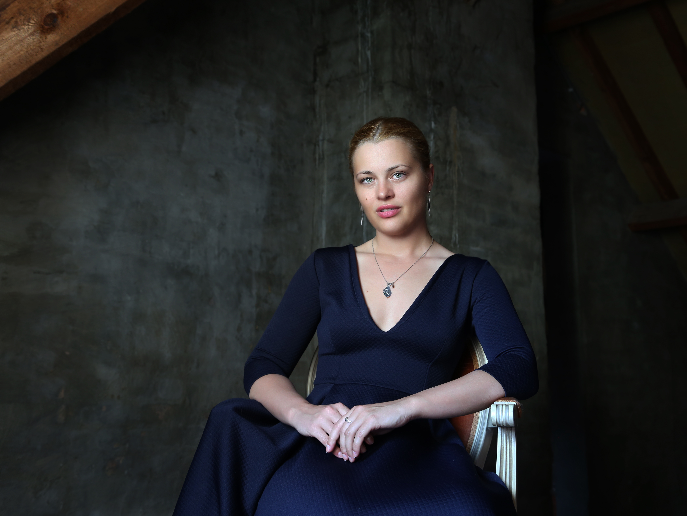
Foto's door Zoya Victorovna

27 Bflat club 2016

Natalia voerde jazzstandaarden uit in het toeristisch hart van Brugge in de jazz club 27Bflat

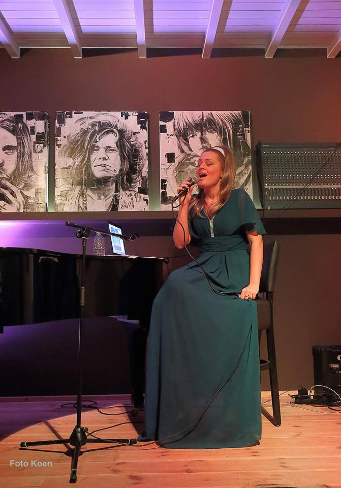
Foto door Koen de Smet

Dudley Recital Hall concert 2015

Natalia kreeg een studiebeurs om deel te nemen aan het Immanuel en Helen Olshan Texas Music Festivalprogramma. Het zomerprogramma "Le Chiavi di Bel Canto" werd gehouden aan de Universiteit van Houston in de Moores School of Music. Daar kreeg ze lessen in acteren en dramatische interpretatie, dictie, podiumbewegingen, dans- en lichaamsbewustzijn. De faculteit bestond uit professionele zangers met jarenlange internationale ervaring, zoals Melanie Sonnenberg, Nova Thomas, Joseph Evans en Ruth Ann. Het programma werd afgesloten met een prachtig concert in de Dudley Recital Hall in Houston.

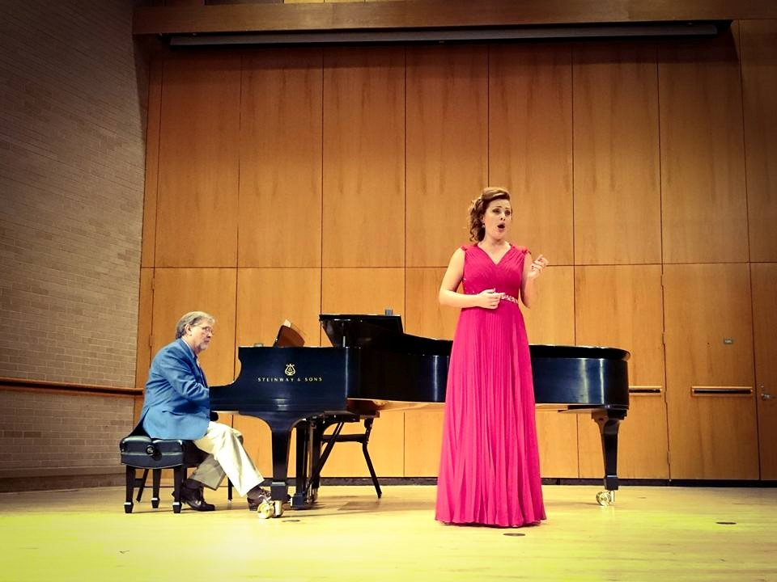

De Ilocano club van Metropolitan Houston 2015

Natalia bracht een mooie vertolking uit van duet "The Prayer" tijdens het galadiner evenement van de Ilocano-club van Metropolitan Houston. Het evenement werd gehouden in het prestigieuze Hilton Houston Galleria Area Hotel.

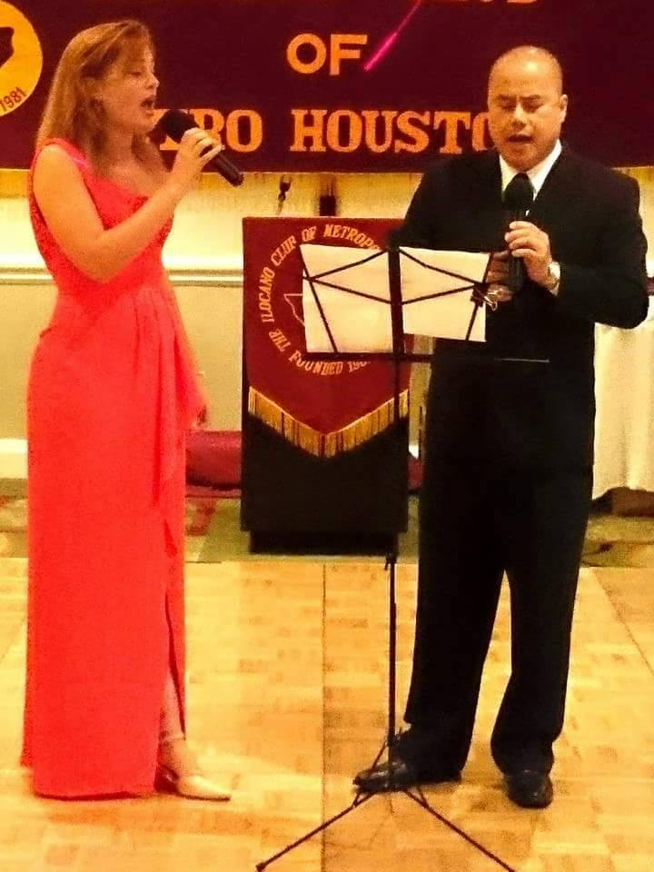

Kamermuziek recitals met Lise Cornillie 2014

Lise en Natalia vormden een vruchtbare samenwerking op de Luca School of Arts. Samen ontdekten ze talrijke cycli van kunstliederen van de romantische en 20e-eeuwse componisten. Ze voerden kamermuziekrepertoire uit op de verschillende locaties in Oost-Vlaanderen en Vlaams-Brabant in 2013 en 2014. "The Nursery" van M. Mussorgsky, "Five Elizabethan Songs" van I. Gurney, "A charm of Lullabies" and "Cabaret Songs" van B. Britten, "Siete Canciones Populares Espanolas" van M. de Falla zijn een paar voorbeelden uit hun uitgebreide lijst van repertoire.

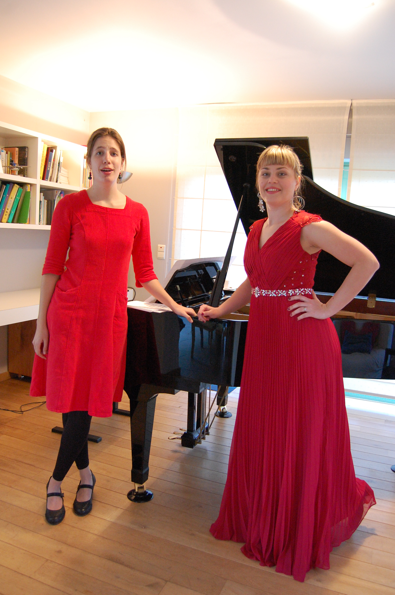

Liedklas concert Luca School of Arts 2013

Liedklas van de Luca School of Arts heeft kunstliederen uit het romantische tijdperk uitgevoerd. Het concert beeldde een volledige levensloop van een vrouw uit. Natalia zong "Nun hast du mir den ersten Schmerz getan" uit liederencyclus "Frauen-Liebe und Leben" van Robert Schumann en "Nachtgang" van Richard Strauss. 

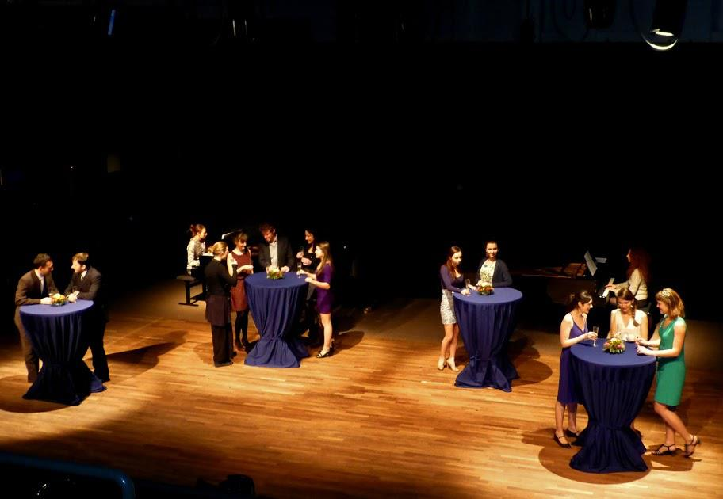

Dido and Aeneas 2011 - 2012

Twee opeenvolgende jaren Natalia was betrokken bij de productie van de barok opera "Dido and Aeneas" van Henry Purcell. Het ensemble werd geleid door dirigent Patrick Peire en regisseur Hugo Segers. Natalia zong in het koor en vertolkte twee rollen, namelijk een dronken zeeman en een tweede heks.

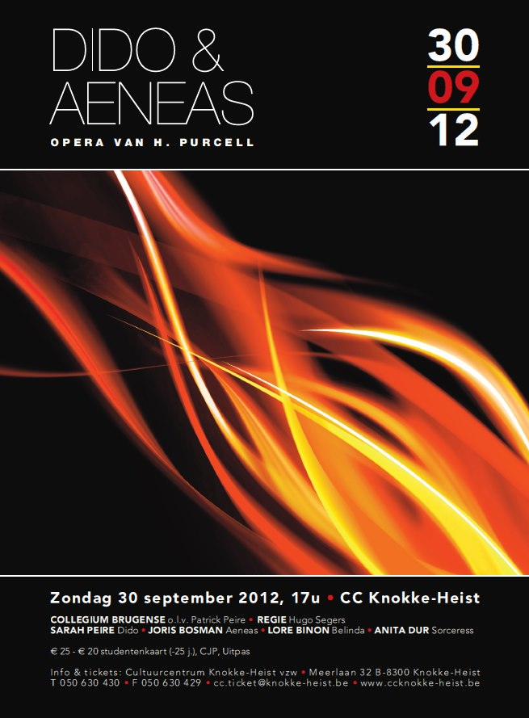

Recital bij Piano’s Maene in Brussels 2010

Mooi klassiek recital dat vond plaats in het Piano’s Maene concert ruimte. Het programma bestond uit kunstliederen en aria's van Nikolai Rimsky-Korsakov, Franz Lehar en Jacques Offenbach. Natalia werd begeleid door een getalenteerde pianist Peter Jeurissen.

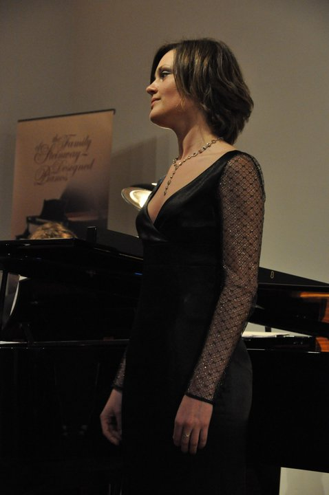

Cocktail dress 2007-2009

Gedurende een aantal jaar Natalia was een leadzangeres van een lounge band "Cocktail Dress". De band bestond uit percussie, zang, elektrische gitaar en basgitaar. Ze hadden een unieke sound die de aandacht trok van de festivalorganisators. Al snel speelden ze in verschillende loungebars en op het Paulus Festival in Oostende. Ze brachten hun eerste demo CD uit met originele nummers en een aantal covers genaamd "Black Russian".

<audio controls src="assets/Projects audio Aphrodizzy.mp3"> </audio>

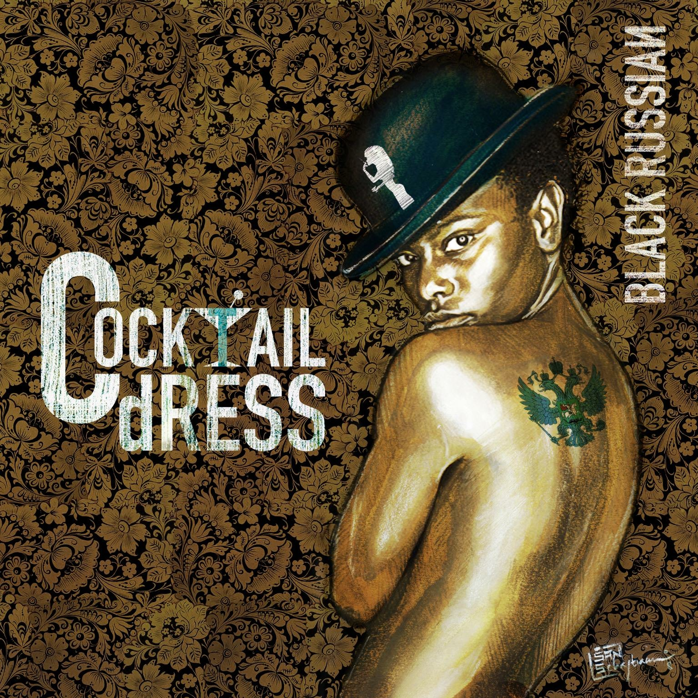

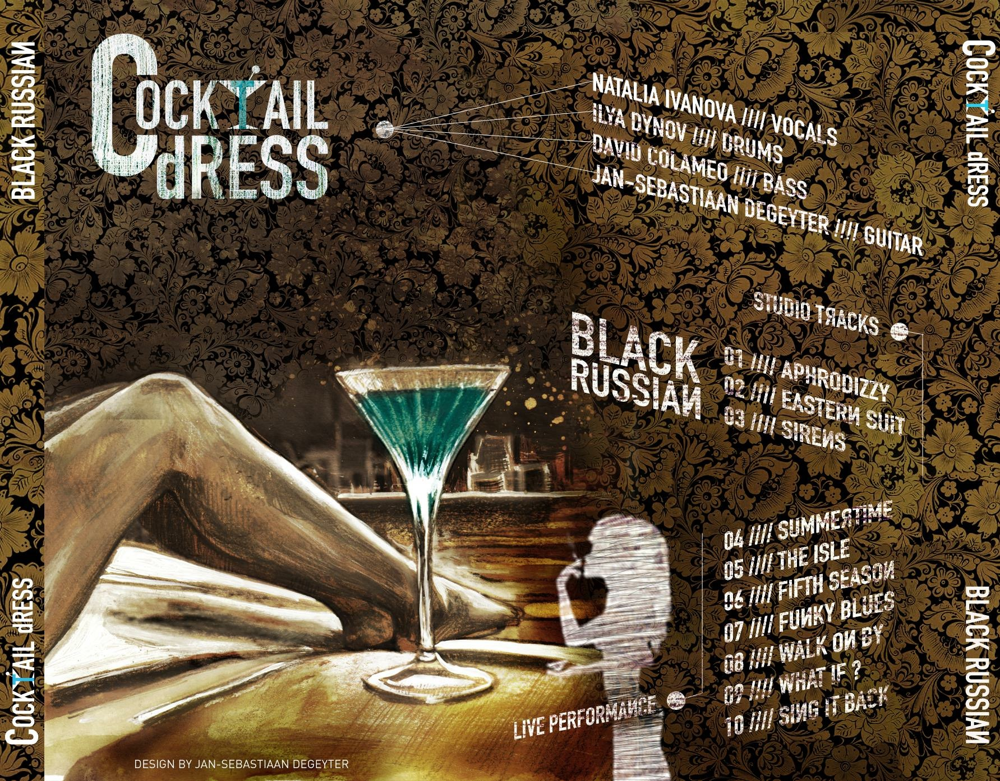

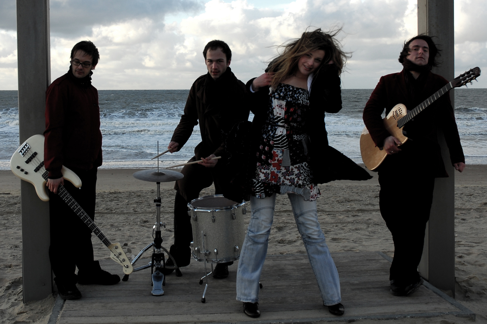
Omslag ontworpen door Jan-Sebastiaan Degeyter

Kunstbende 2004

Natalia begon haar zangcarrière door deel te nemen aan de lokale talentenjacht “Kunstbende”. Ze speelde piano en zong een cover "How come you don’t call me". Met veel lof van de juryleden bereikte ze de finale. Daar ontmoette ze andere jonge muzikanten, fotografen, dansers en kunstenaars. Natalia is verschenen in de plaatselijke krant Brugsch Handelsblad. Dit positieve ervaring heeft Natalia ertoe aangezet om haar zangcarrière voort te zetten.

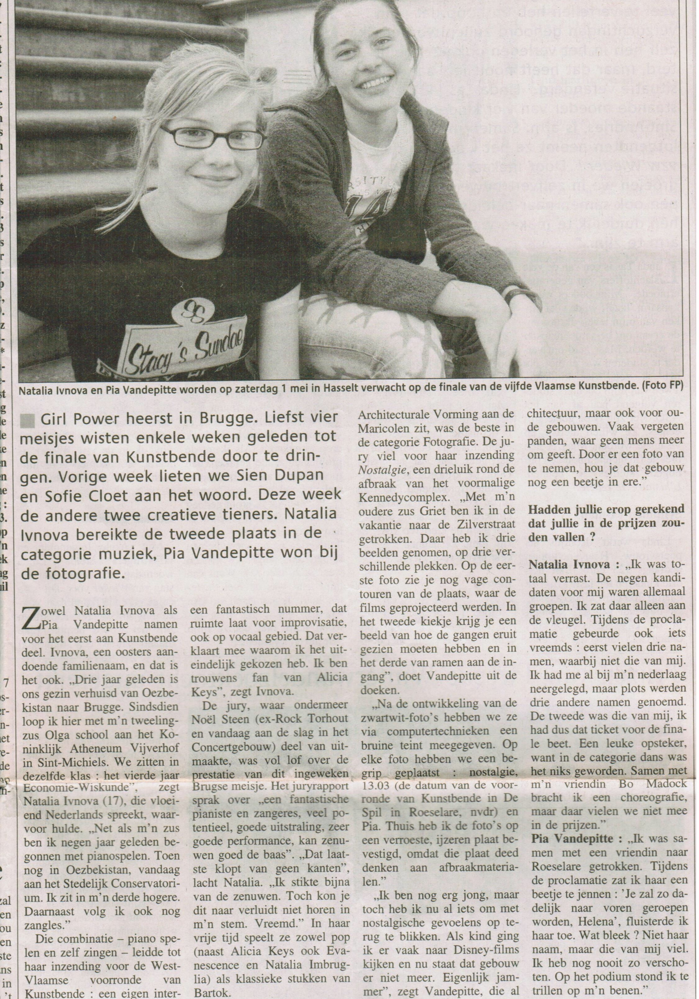

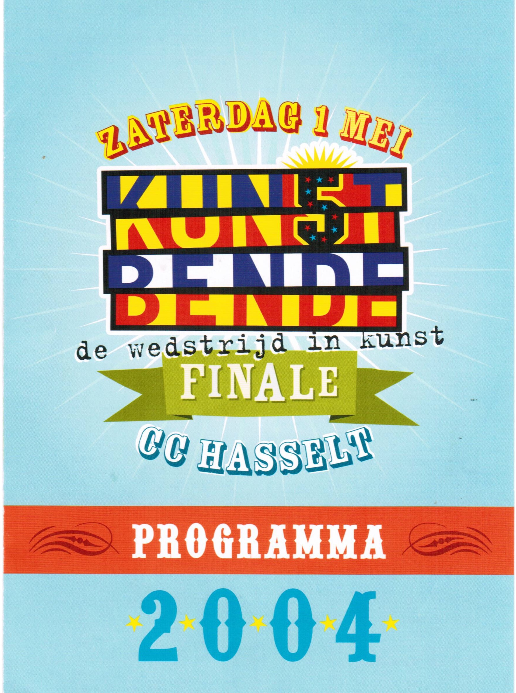
