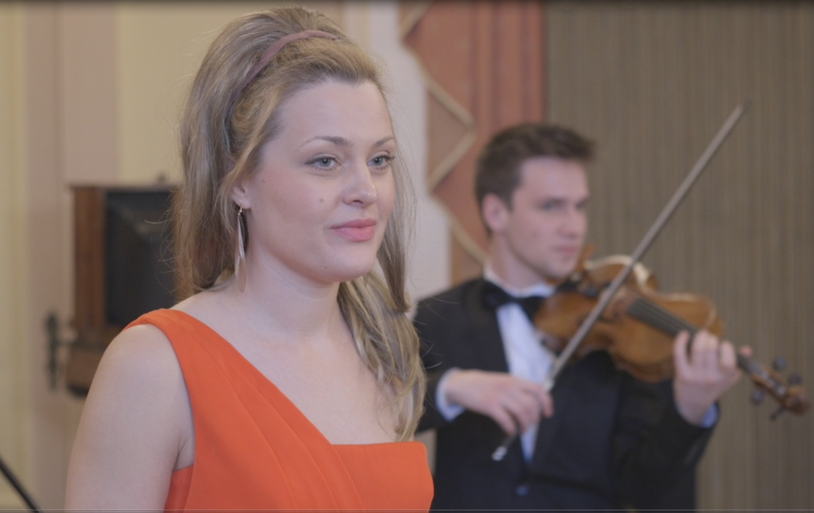
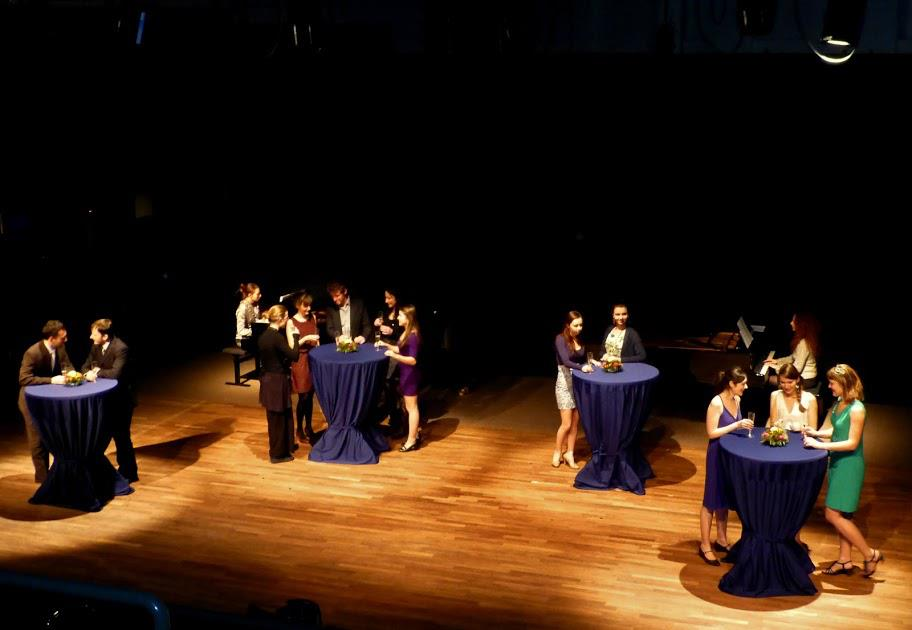
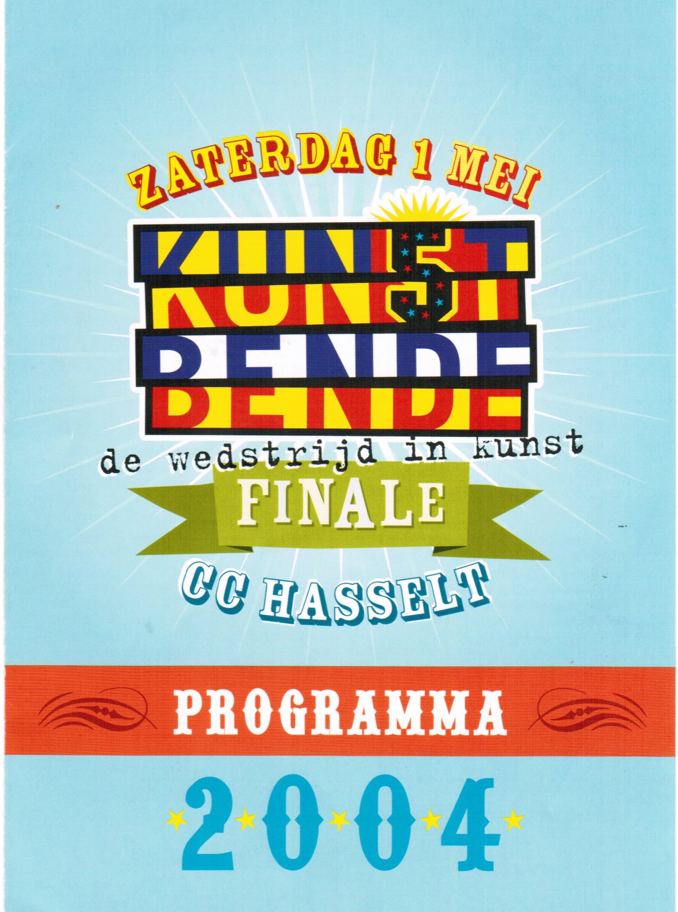

Уроки вокала на Ютюбе 2018

Наталья делится своим опытом вокального мастерства на Ютюб канале. Там вы можете найти различные упражнения, которые помогут вам развить ваш голос. Обсуждаются такие темы как опора дыхания, проекция, микс, образ жизни, физические упражнения и другие инструменты, необходимые для помощи певцам на их пути к cвободному звукоизвлечению.

Концертный зал «Handelsbeurs» 2017

17 октября 2017 года концертному залу «Handelsbeurs» исполнилось 15 лет. Наталья учавствовала в российском фестивале, организованным CirQ на главной площади Коутера в Генте. Там она пела русские народные песни в сопровождении пианиста Майка Жюльена. По этому случаю её также пригласили записать рекламный ролик на радио 1.

(Handelsbeurs 15 mp3)

Зимний концерт в замке Лейселебеке 2017

Прекрасный классический концерт, организованный в самом сердце Синт-Михилса в великолепном замке Лейселебеке. Трио-ансамбль в составе Виктора Певернаге, Александра Деклерка и Натальи Ивановой исполнял художественные песни, арии и дуэты эпохи романтизма и классики. В программу вошли пьесы Чайковского, Бизе, Штрауса, Моцарта и Берлиоза.

Мюзикл «Kрасавица и чудовище» 2017

Летом 2017 года школа танцев «Роза Де Лейн» поставила мюзикл «Красавица и чудовище». Наталья режиссировалa и руководила постановкой песен в мюзикле. Онa с радостью сопровождала и учила молодых танцоров петь и играть на сцене.

Концерт «Роза Де Лейн» 2016

Наталья исполняла «Хабанеру» Бизе из известной оперы «Кармен» на концерте в «Роза Де Лейн». На фортепиано Наталью аккомпанировал Александр Деклерк.

Фотосессии с Зоей Викторовной 2016

Зоя и Наталья занимались художественной постановкой фотосессий, создавая каталог дизайнерской одежды Зои Викторовны. Фотографии были вдохновлены летним бризом, красотой Северного моря, цветами и фильмом Леди Макбет.

Фотографии предоставлены Зоей Викторовной

Выступление в 27 B Flat 2016

Наталья исполнила джазовые стандарты в центре Брюггского джаз клуба 27b Flat.

Выступление в концертном зале Дадли 2015

Наталья получила стипендию для участия в программе Техасского музыкального фестиваля имени Иммануила и Елены Ольшан. Летняя программа «Ключи Бельканто » проводилась в музыкальной школе Университета Хьюстонa. Там она получила уроки актерского мастерства и драматического исполнения, дикции, сценического движения, танца и чувствования тела. Факультет состоял из профессионалов с многолетним международным опытом, таких как Мелани Сонненберг, Нова Томас, Жозеф Иванс и Рут Aнн. Программа завершилась прекрасным выступлением в концертном зале Дадли в Хьюстоне.

Выступление в Илокано клубе Хьюстона 2015

Наталья исполнила замечательную версию дуэта «Молитва» на торжественном ужине в клубе Илокано митрополита Хьюстона. Мероприятие было организовано в престижном отеле Hilton Houston Galleria Area.

Концерты камерной музыки с Лизой Карнили 2014

Лиза и Наталья создали плодотворное сотрудничество в Школе Исскуств Луки. Oни изучили многочисленные циклы художественных произведений романтических композиторов и композиторов 20-го века. Они исполнили репертуар камерной музыки на разных площадках Восточной Фландрии и Фламандского Брабанта. Вокальные цыклы « Детская » М. Мусоргского, «Пять елизаветинских песен» И. Герни, «Очарование колыбельных песен » и «Песни кабаре» Б. Бриттенa, «Семь Испанских популярных песен» М. де Фалья - это всего лишь несколько примеров из их репертуара.

Концерт художественной песни Школа Искусств Лука 2013

На уроке камерной музыки Школы Искусств исполнялись песни из романтической эпохи. Наталья исполнила песни Роберта Шумана и Рихарда Штрауса.

Оперa «Дидона и Эней» 2011 - 2012

Два последующиx года Наталья была задействована в оперe «Дидона и Эней» Генри Перселла. Ансамбль возглавляли дирижер Патрик Пейр и художественный постановщик Хьюго Сегерс. Наталья пела в хоре а также исполнила две второстепенные роли, а именно пьяного моряка и вторую ведьму.

Концерт в зале «Пианинo Мане» в Брюсселе 2010

Прекрасный классический концерт, который состоялся в концертном зале «Пианинo Мане». В программе были музыкальные произведения Николая Римского-Корсакова, Франца Легара и Жака Оффенбаха. На фортопиано играл талантливый пианист Питер Юриссен.

Группа «Коктейльное Платье» 2007-2009

В течение нескольких лет Наталья была солисткой группы «Коктейльное Платье». Группа состояла из перкуссии, вокала, электрогитары и бас-гитары. Они создали уникальный звук и оригинальные песни, которые привлекли внимание организаторов фестиваля. Очень скоро они выступали в разных лаунж-барах и на фестивале Паулюса в Остенде. Они выпустили свой первый студийный альбом с оригинальными песнями и несколькими каверами под музыкальным названием коктейля «Чёрньй Русский».

(Projects audio Aphrodizzy)

Дизайн обложки: Ян-Себастьян Дегейтер

Конкурс «Команда Исскуства» 2004

Наталья начала свой певческий путь, приняв участие в местном конкурсе талантов. Она играла на рояле и пела песню на Английском языке «Почему ты не звонишь мне?». Благодаря этой песни она сразу попала в финал. Там она познакомилась с другими молодыми музыкантами, фотографами, танцорами и художниками. По этому случаю Наталья появилась в местной газете Brugsch Handelsblad. Этот опыт побудил Наталью продолжить певческую музыкальную карьеру.

